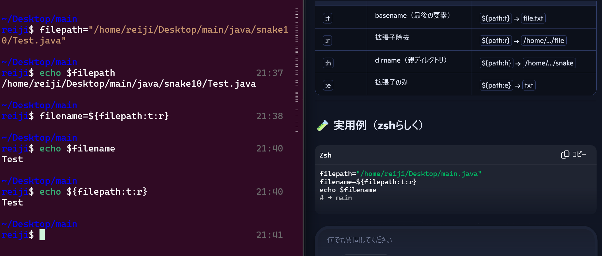

# 見出し1
## 見出し2
### 見出し3
#### 見出し4
##### 見出し5
###### 見出し6

## 箇条書きリスト

- リスト1
    * リスト1_1
        * リスト1_1_1
        - リスト1_1_2
    - リスト1_2
- リスト2
- リスト3

## 番号付きリスト

1. 番号付きリスト1
    1. 番号付きリスト1_1
    1. 番号付きリスト1_2
1. 番号付きリスト1
1. 番号付きリスト1

## リンク

[リンク先のタイトル名](https://translate.google.co.jp/?hl=ja&sl=en&tl=ja&op=translate)

## 画像  

## 引用

> お世話になっております。
> 
> ご連絡頂いた
>
>> お世話になっております。
>> 新機能のバグの件で連絡しました
> 
> 

## 強調

normal *italic*
normal _italic_

normal **italic**
normal __italic__

# 水平線

___

***

- - -

